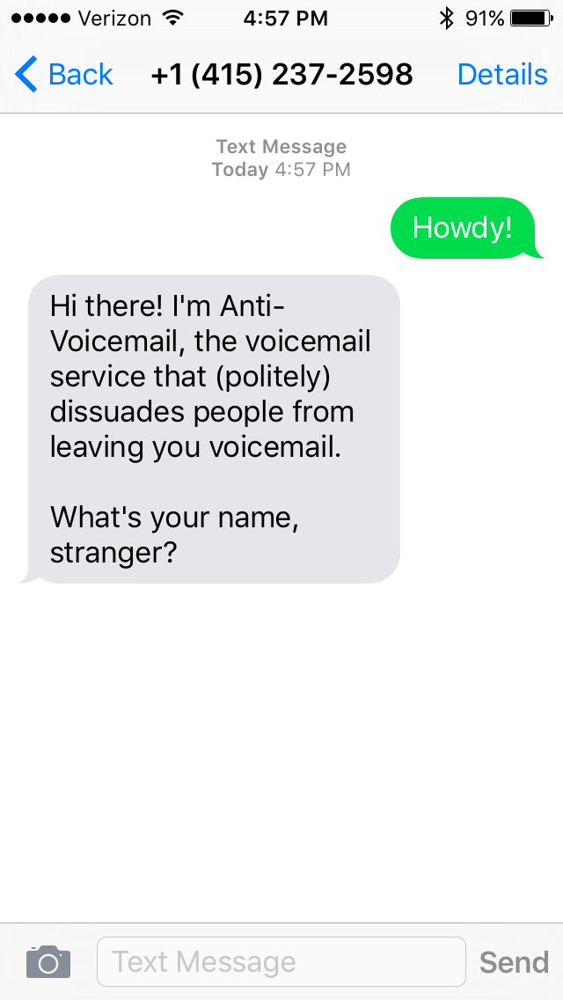

# Anti-voicemail

[](https://travis-ci.org/atbaker/anti-voicemail)
[](https://coveralls.io/github/atbaker/anti-voicemail?branch=master)

A voicemail app for people who really, really don't like receiving voicemails.

**NOTE:** This project is not actively maintained, though I'm happy to talk about
it if you're interested in using it. Open an issue or hit me up on Twitter (@andrewtorkbaker)

**Try it yourself:** Call the demo number at
[+1 (202) 499-7699](tel:+12024997699). (Your phone number will not be recorded.)

Using [Twilio](https://www.twilio.com/), Anti-voicemail actively dissuades
callers from leaving you voicemail by:

- Sending callers from mobile phones a text message with your contact info
- Requiring callers from non-mobile phones to press a button before leaving a voicemail

In the unfortunate event you *do* receive a voicemail, Anti-voicemail will
send you a text message with a transcription of the voicemail so you don't have
to listen to it.

Anti-voicemail also has a few other handy features. You can:

- Listen to and download voicemail recordings (loathing optional)
- Add phone numbers to a whitelist of callers who are always allowed to leave
you voicemail
- Save your Anti-Voicemail configuration to your phone in case you need to set
it up again

Anti-voicemail is a Python [Flask](http://flask.pocoo.org/) web application
with code that's
[well tested](https://coveralls.io/github/atbaker/anti-voicemail) and
[liberally commented](https://github.com/atbaker/anti-voicemail/blob/master/app/voice/views.py).
It's designed to be easy to deploy and easy to customize.

Interested? Then read on to deploy your own Anti-voicemail.

## Setup

To use Anti-voicemail, you'll need three things:

1. A **Twilio account**
1. A **publicly available server** to host the Anti-voicemail app (I recommend Heroku)
1. Your phone is on one of Anti-voicemail's **supported carriers**

Anti-voicemail currently supports these wireless carriers:

**US carriers**

Carrier | Supported
--- | :---:
AT&T Wireless | ✔
T-Mobile USA, Inc. | ✔
Verizon Wireless | ✔

**International carriers**

(None yet - please help add one!)

**Don't see your carrier?** You can help add it! See
[Adding a new carrier]() below.

### Get a Twilio account

Before you can deploy Anti-voicemail, you will need a Twilio account.
[Sign up for one here](https://www.twilio.com/try-twilio).

You can set up and test Anti-voicemail with a free trial account, but
**your voicemail won't work for anyone else until you upgrade your account.**
This is because Twilio requires phone number verification for all calls and
messages sent from trial accounts
([more information at the bottom of this FAQ](https://www.twilio.com/help/faq/twilio-basics/how-does-twilios-free-trial-work)).

Twilio's pricing scales with usage, so your Twilio bill will vary based on how
many missed calls Anti-voicemail handles. Most people, however, can expect their
Twilio spend for Anti-Voicemail to be $1-2 / month.

### Deploy Anti-voicemail to Heroku (recommended)

Once you have a Twilio account, you need to deploy the Anti-Voicemail code to
a publicly accessible server.

**I highly recommend deploying Anti-Voicemail on Heroku.** It's free, quick,
and secure. Start by clicking this button:

[](https://heroku.com/deploy?template=https://github.com/atbaker/anti-voicemail)

Then:

1. Sign up for a Heroku account if you don't have one already
1. On the "New app" screen, scroll down to the **Config Variables** section
1. Fill out the form as follows:
    - **TWILIO_ACCOUNT_SID** - Found under 'Show API Credentials' in
    [your Twilio console](https://www.twilio.com/user/account/voice/)
    - **TWILIO_AUTH_TOKEN** - Found next to your Account Sid in your Twilio
    console
    - **TWILIO_PHONE_NUMBER** - Grab one from
    [here](https://www.twilio.com/user/account/phone-numbers/incoming). Trial
    accounts receive their first one free.
        - Make sure to use the [E.164](https://en.wikipedia.org/wiki/E.164) format,
        which starts with a plus sign
    - **FLASK_CONFIG** - Keep this value's default, `production`
1. Click "Deploy for free"

Heroku will take a few minutes to deploy your Anti-voicemail instance. When it's
done, click the "View" button. If everything went smoothly, you will see a message
telling you to text your Twilio phone number to finish the setup.

Anti-voicemail will then guide you through the rest of the process:

<p align="center">
    
</p>

### Other ways to deploy Anti-voicemail

If you don't want to deploy using Heroku, you have a couple other options:

**Docker**

Anti-voicemail is also available as an image on the
[Docker Hub](https://hub.docker.com/). Here's the best way to get it started:

If your server has Docker installed, the easiest way to get Anti-Voicemail going
is probably:

1. Download the
[docker-compose.prod.yml](https://github.com/atbaker/anti-voicemail/blob/master/docker-compose.prod.yml)
to your server:

    ```
    curl -O https://github.com/atbaker/anti-voicemail/blob/master/docker-compose.prod.yml
    ```
1. Update the file with your values for the environment variables, or set each
of them in your session with `export`
1. Start Anti-voicemail by running `docker-compose up -d`

Docker will pull the latest image from the
[atbaker/anti-voicemail](https://hub.docker.com/r/atbaker/anti-voicemail/) Docker
Hub repository and then start a container from it on your server using your
values for the environment variables.

Then go to http://your-server-name-here and you should see a message telling you
to text your Twilio phone number to finish the setup.

**Natively with Python**

You can also deploy Anti-voicemail the old-fashioned way. If you're considering
this, you probably know what you're doing so I'll just provide a rough outline:

1. Get the source code onto your server
1. Create a new virtualenv running Python 3.4
([pyenv](https://github.com/yyuu/pyenv) may be helpful)
1. Install Anti-voicemail's requirements
1. Optionally set up a web server like [Nginx](http://nginx.org/en/docs/) or
[Apache](https://httpd.apache.org/)
1. Start the Anti-voicemail process with:

    ```
    gunicorn manage:app
    ```

You may find the
[Full Stack Python Deployment](http://www.fullstackpython.com/deployment.html)
page a helpful reference.

Once you can access your site through a web browser, text your Twilio phone
number to complete the setup process.